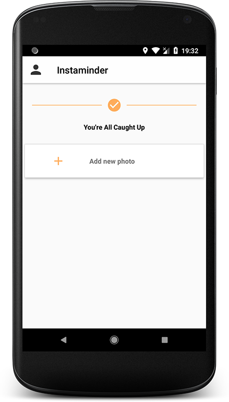
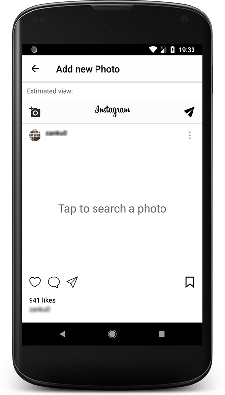
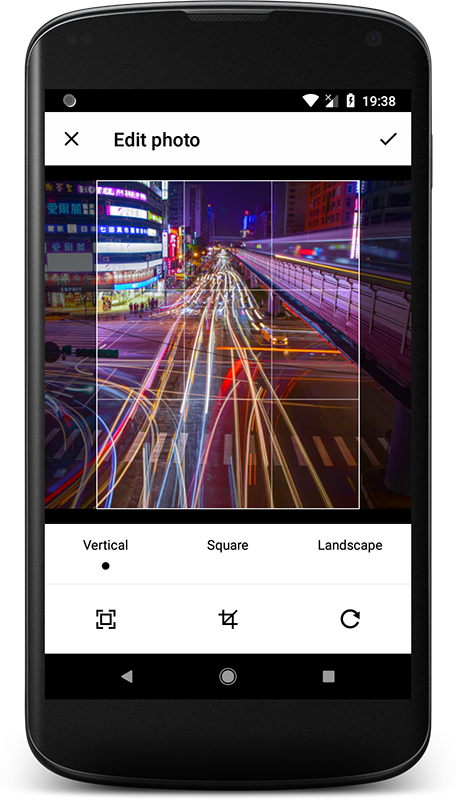
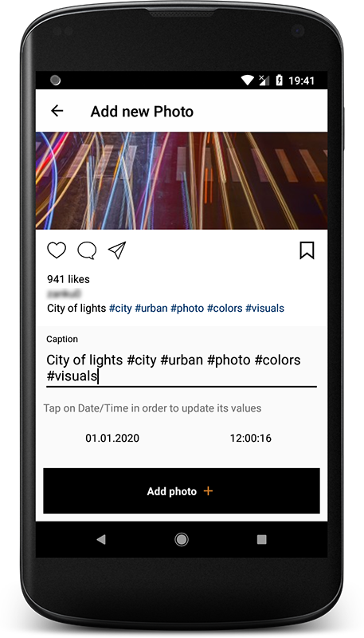
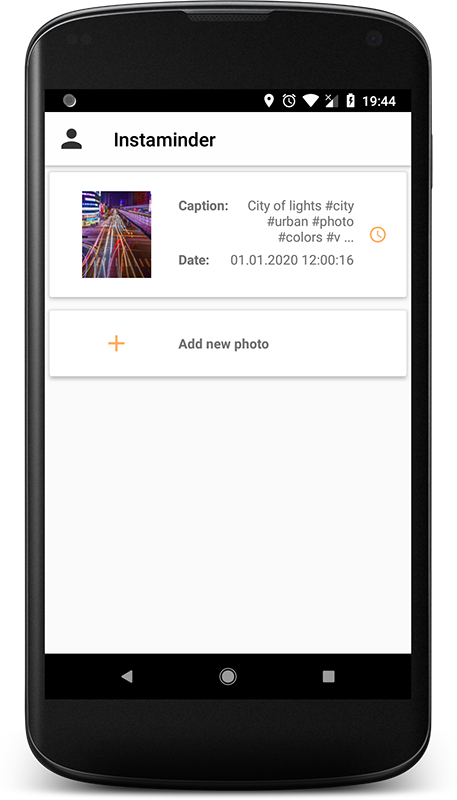

Instaminder
==============

Instaminder is the perfect tool to improve your workflow as a professional user of Instagram.

Set the exact moment you want to upload your edited pick, and create your own schedule. By this way, Instaminder will upload for you all your content at the time you decided.

You can also preview the final view of your content, write the caption and the hashtags.

**FUNCTIONS**

* Set the time to upload your pictures and Instaminder will do it for you.
* Write your caption and hashtags.
* Crop and rotate your edited photo to comply with the instagram ratios.
* Preview your content.

**USAGE**

* You need to have internet connection at the time the picture will be upload as we use the internal android clock to synchronize the operations.
* Take in account that the picture will be upload at your time zone (i.e. GMT, BST, IST,…)
* You can’t edit your pictures with instaminder (only crop and rotate), just set upload times.

**NOTE**

* This app is by no means affiliated to Instagram

Any comment will be welcome.

Enjoy!

[Download](app/release/Instaminder-v1.0.3.apk) the app last version from this repo (app/release/), signed with [OutOfbounds Soft.](https://play.google.com/store/apps/developer?id=Out+of+Bounds+Software+Inc) license

 
# Usage

1- Log in

2- Click ot add new tasks

3- Tap and search for the photo you want to upload

4.1- Edit to fit Instagram requirements (if needed)

4.2- Add some awesome hashtags and set a date and time for the photo to be uploaded

5- Sit a relax, now you have the job scheduled :_)

6- Just in case, you can edit the caption and date/time whenever you want (always before the previously date/time)

# Developer notes

I have tried to update myself to last Android developing version and 
use different famous Google and third party libraries, applying concepts 
[Clean Architecture](https://8thlight.com/blog/uncle-bob/2012/08/13/the-clean-architecture.html). 

Some technologies/tools used are:
- [Android Studio](https://developer.android.com/studio/index.html) 3.1
- Java language
- [Dagger2](https://github.com/google/dagger) for Dependency Injection
- [Butter Knife](https://github.com/JakeWharton/butterknife) for binding UI elements
- [Glide](https://github.com/bumptech/glide) for loading Image resources
- [Realm](https://github.com/realm/realm-java) as local DB management
- [RoundedImageView](https://github.com/vinc3m1/RoundedImageView) from [Vince Mi](https://github.com/vinc3m1) (Nice work dude!)
- [uCrop](https://github.com/Yalantis/uCrop) from [Yalantis](https://github.com/Yalantis)
- [Instagram4Android](https://github.com/charlieAndroidDev/Instagram4Android) from [charlieAndroidDev](https://github.com/charlieAndroidDev)

# References

[1]<a href="https://google.github.io/dagger/" target="_blank"> 
    Dagger 2 documentation from Google
    </a>
     
[2]<a href="https://www.amazon.com/Clean-Code-Handbook-Software-Craftsmanship/dp/0132350882" target="_blank"> 
    Clean Code at Amazon 
    </a>
    <a href="https://en.wikipedia.org/wiki/Robert_Cecil_Martin" target="_blank">
    Author: Robert Cecil Martin
    </a>
     
[3]<a href="https://www.amazon.com/Clean-Architecture-Craftsmans-Software-Structure/dp/0134494164" target="_blank"> 
    Clean Architecture at Amazon 
    </a>
    <a href="https://en.wikipedia.org/wiki/Robert_Cecil_Martin" target="_blank">
    Author: Robert Cecil Martin
    </a>
     
[4]<a href="https://developer.android.com" target="_blank"> 
    Android documentation from Google
    </a>
     